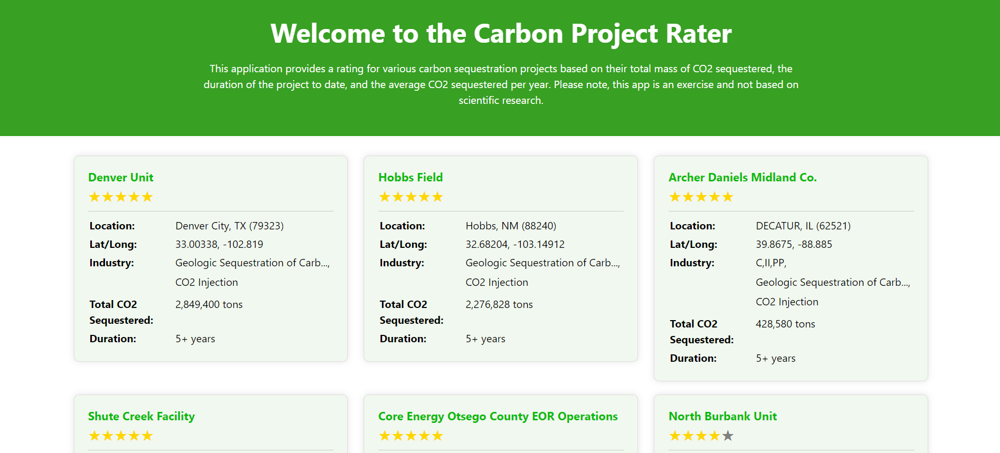
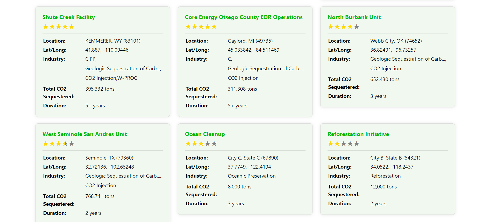
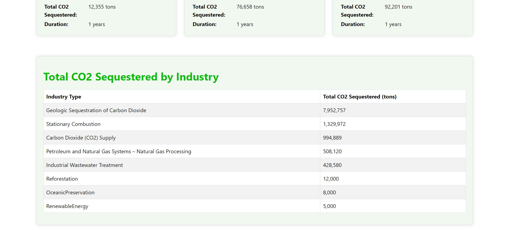

# 🌍 Carbon Project Rater

## 📊 Overview 
The Carbon Project Rater is a full-stack application designed to rate carbon offset projects based on their effectiveness in emissions capture, avoidance, and sequestration. This system is currently an exercise in utilising a combination of industry standard tools and modern technologies to provide a robust backend, frontend, and API layer.



## 💻 Technologies Used 
- **Backend**: Python, Flask, SQLAlchemy, PostgreSQL
- **API Layer**: Node.js, Express
- **Frontend**: React
- **Containerization**: Docker, Docker Compose
- **Data Transformation**: DBT (Data Build Tool)
- **Deployment**: AWS Services (RDS, ECS, ECR, EC2, VPC, IAM, AWS Cloud Map, CloudFormation)

## 📂 Project Structure
- `backend/`: Contains Flask application setup and SQLAlchemy models.
- `api/`: Node.js and Express setup for API management.
- `frontend/`: React application setup including components and services.
- `dbt/`: Contains DBT models for data transformation in PostgreSQL.
- `docker-compose.yml`: Defines the services, networks, and volumes for docker containers.

## ⭐ Features
- Rate carbon offset projects based on predefined criteria.
- Retrieve, create, update, and delete project ratings.
- Interactive frontend for displaying project ratings with star icons.
- Automated data loading from CSV files.
- Data transformation using DBT for efficient data handling and reporting.
- Sorted display of CO2 sequestration by industry.



## 📈 CO2 by Industry Data
The application includes an endpoint to retrieve the total CO2 sequestered by industry. This data is transformed and aggregated using DBT (Data Build Tool) and displayed in descending order of total CO2 sequestered.

### 🛠️ DBT (Data Build Tool)
DBT is used to transform raw data in the PostgreSQL database into a format that is easier to query and analyze. The DBT models are located in the `dbt/` directory and include the following transformations:
- **Aggregating CO2 Data**: Aggregates the total mass of CO2 sequestered by industry type from raw project data.
- **Creating Views**: Creates views in the database to simplify querying CO2 data by industry.

### 🏭 Example Endpoint
- **GET /co2_by_industry**: Retrieves the total CO2 sequestered by industry, ordered from most to least.



## 🌱 Setup and Installation

### 📋 Requirements
- Docker Desktop: Ensure Docker Desktop is installed and running.
  - Docker 19.03.0+
  - Docker Compose 1.25.0+
- Python 3.8+: Ensure Python is installed
- Virtual Environment: Required for managing dependencies.

### 🚀 Getting Started
To get the application running locally with Docker:

1. Clone the repository:
```
   git clone https://github.com/yourusername/carbon-project-rater.git
   cd carbon-project-rater
```

2. Set up a virtual environment:
```
   python -m venv venv
```

3. Activate the virtual environment:
- On Windows:
```
  venv\Scripts\activate
```
- On MacOS/Linux:
```
  source venv/bin/activate
```

4. Build and run the containers:
```
   # Ensure docker desktop is running
   docker-compose up --build
```

This command will install the requirements and start all services specified in `docker-compose.yml`. The frontend will be accessible at [http://localhost:3000](http://localhost:3000), the API at [http://localhost:5001](http://localhost:5001), and the backend at [http://localhost:4000](http://localhost:4000). The database will run on the default PostgreSQL port 5432.

## 🧪 Testing
How to run the automated tests for this system:

- Backend tests:
```
  cd backend
  python -m unittest
```

- API tests:
```
  cd api
  npm test
```

- Frontend tests:
```
  cd frontend
  npm test
```

## 🌞 Deployment
This application was previously deployed via AWS, but due to running costs is now being developed locally.

### AWS Services Used
- **IAM:** Managed permissions and access control.
- **VPC:** Configured a Virtual Private Cloud for network isolation.
- **RDS:** Deployed PostgreSQL database on Amazon RDS.
- **ECR:** Stored Docker images in Amazon Elastic Container Registry.
- **ECS:** Deployed containerized services using Amazon Elastic Container Service.
- **EC2:** Hosted the ECS cluster on Amazon EC2 instances.
- **AWS Cloud Map:** Service discovery for ECS services.
- **CloudFormation:** Infrastructure as code to automate the deployment of AWS resources.

## 📝 Contributing
Contributions and pull requests are very welcome! Please fork the repository and use a feature branch.

## 📜 License
This project is licensed under the MIT License - see the LICENSE.md file for details.